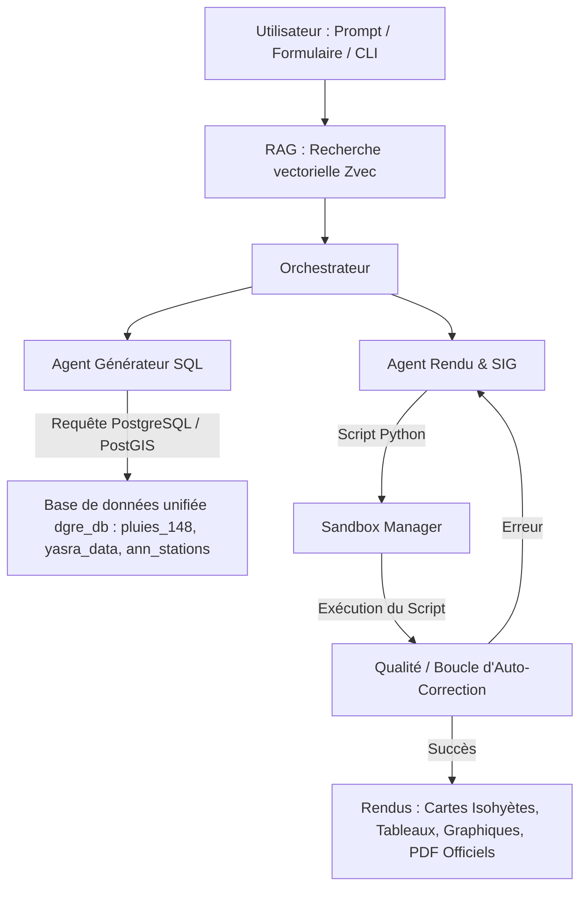

# CartaGen - DGRE (Direction Générale des Ressources en Eau)

CartaGen est une application intelligente et multi-agents développée pour la Direction Générale des Ressources en Eau (DGRE) de Tunisie. Elle permet d'interroger, d'analyser, de cartographier et de publier automatiquement les données pluviométriques et hydrologiques nationales à partir d'un simple prompt en langage naturel ou d'un formulaire interactif.

---

## 🚀 Architecture & Pipeline Global de l'Application

L'application repose sur un orchestrateur supervisant un workflow complet d'agents spécialisés (Supervisor Pattern) combiné à un RAG sémantique in-process :



### Le Workflow détaillé :
1. **Recherche Sémantique (RAG)** : Dès qu'une requête en langage naturel est reçue, l'index vectoriel local **Zvec** recherche les stations (parmi les stations retenues de `yasra_data`) et les schémas de table correspondants pour fournir un contexte précis au LLM.
2. **Text-to-SQL Agent** : Traduit la demande de l'utilisateur en requête SQL PostgreSQL/PostGIS optimale sur la table filtrée `pluies_148`.
3. **SIG / Code Generator Agent** : Génère le script Python à exécuter (avec pandas, matplotlib, geopandas, scipy) pour traiter les données et produire les cartes d'isohyètes ou les graphes.
4. **Sandbox Manager** : Exécute le script généré dans un sous-processus isolé.
5. **Quality Agent (Refinement Loop)** : Analyse la sortie standard et les logs d'erreurs en cas d'échec. Il corrige automatiquement le code et relance la Sandbox.
6. **Publication & Rendu** : Sert l'image, le tableau de données, le code source ou génère des annuaires complets au format PDF conformes aux éditions officielles DGRE.

---

## 🛠️ Options & Fonctionnalités Clés

### 1. Génération de Cartes Spatialisées (Isohyètes)
* Interpolation géospatiale de haute précision par la méthode IDW (Inverse Distance Weighting).
* Chargement des contours géographiques de la Tunisie et des gouvernorats depuis PostGIS (projection UTM 32N / EPSG:32632).
* Contouring automatique sans lignes à $0\text{ mm}$ et coloriage thématique avec échelles officielles de la DGRE (annuelle, saisonnière et mensuelle).
* Cartes additionnelles d'**isohyètes moyennes interannuelles** (fenêtre glissante de 20 ans) et du **rapport à la normale (%)**.

### 2. Analyses & Tableaux Statistiques
* Extraction automatique des cumuls pluviométriques journaliers, mensuels et saisonniers depuis la table nettoyée `pluies_148`.
* Utilisation directe des moyennes historiques (`moy_`) et des pourcentages (`pct` / `%`) issus directement de la table `yasra_data` (sans recalculs).
* Génération d'histogrammes mensuels et de diagrammes circulaires pour la répartition par saison.

### 3. Éditeur d'Annuaires Pluviométriques Nationaux & Régionaux (PDF Officiel DGRE)
* Génération dynamique de l'annuaire au format PDF conforme aux normes d'édition de la DGRE.
* **Structure du document PDF** :
  1. **Page de Garde Officielle** : Titres, logos, coordonnées (Rue la MANOUBIA, téléphone, fax) et date d'édition.
  2. **AVANT-PROPOS** : Rôle des 24 CRDA, de la sous-direction d'hydrologie analytique et des bases de données, mentions d'élaboration/vérification/validation.
  3. **Présentation de l’Annuaire** : Répartition des 6 grandes régions naturelles (*Nord Ouest, Nord Est, Centre Ouest, Centre Est, Sud Ouest, Sud Est*), méthodologie de sélection des 148 stations et critique des données (software HYDRACCES).
  4. **1. Aperçu Sommaire sur la Pluviosité** :
     - Synthèse textuelle **100% dynamique** selon l'année hydrologique avec identification des min/max par gouvernorat.
     - **Tableau 1 (Comparaison régionale)** : Tableau compacté avec abréviations adaptées à la largeur de page.
     - **Tableau 2 (Données historiques)** : Extraction dynamique des 8 dernières années dans `pluies_148` avec détection automatique des lacunes historiques et message d'avertissement.
  5. **Table des Matières**, Liste des Figures et Liste des Tableaux (`\tableofcontents`).
  6. **Analyses mensuelles, saisonnières, cartographie d'isohyètes et relevés journaliers détaillés**.
  7. **Pied de page officiel sous toutes les pages** : Mention *"Annuaire Pluviométrique de la Tunisie - Ministère de l'Agriculture..."*.

---

## 📦 Schéma des Données Unifiées & Tables Principales

L'application utilise un modèle optimisé s'appuyant sur :
* `pluies_148` : Table principale filtrée des observations pluviométriques journalières (~838k lignes) correspondant strictement aux 142 stations retenues.
* `yasra_data` : Table de référence des 148 stations contenant les normales mensuelles/saisonnières/annuelles, la moyenne historique (`moy_`) et le pourcentage (`pct` / `%`) importés d'Excel.
* `ann_stations` : Référentiel des stations (coordonnées UTM 32N $x$/$y$, altitude, gouvernorat, bassin).
* `limite_pays_polygon` & `gouvernorats` : Geometries PostGIS en UTM 32N (EPSG:32632) pour les masques spatiaux.

---

## 📊 Formules de Calcul des Statistiques

Les statistiques du rapport et des tableaux récapitulatifs (Tableaux 1, 2 et 3) sont calculées selon les formules mathématiques suivantes :

### 1. Moyennes Régionales (Pluies et Normales)
Pour chaque région naturelle $R$, la pluviométrie moyenne $P_R$ (ou la normale moyenne $N_R$) est calculée en utilisant la méthode d'intégration spatiale des **Polygones de Thiessen (Voronoi)**.
Chaque station active $i$ se voit attribuer un coefficient de pondération spatial correspondant à l'aire de sa zone d'influence exclusive intersectée avec les limites de la région naturelle :
$$P_R = \sum_{i} P_i \times w_i^R \quad \text{et} \quad N_R = \sum_{i} Normal_i \times w_i^R$$
*Où $w_i^R$ est le poids surfacique normalisé de la station $i$ au sein de la région $R$ :*
$$w_i^R = \frac{\text{Aire}(\text{Polygone}_i \cap \text{Région}_R)}{\sum_{k} \text{Aire}(\text{Polygone}_k \cap \text{Région}_R)}$$
*Les polygones de Voronoi sont calculés à l'échelle nationale à partir des coordonnées UTM 32N des stations, puis intersectés dynamiquement avec les limites administratives des régions.*

### 2. Moyennes Nationales (TUNISIE)
La moyenne nationale (TUNISIE) est calculée de manière **pondérée par la superficie** des 6 grandes régions naturelles pour refléter fidèlement la hauteur de lame d'eau globale sur le pays :
$$P_{\text{TUNISIE}} = \frac{\sum_{R} (P_R \times A_R)}{\sum_{R} A_R} \quad \text{et} \quad N_{\text{TUNISIE}} = \frac{\sum_{R} (N_R \times A_R)}{\sum_{R} A_R}$$
*Où $A_R$ représente la superficie (en $\text{km}^2$) de la région $R$.*

### 3. Rapports à la Normale (%)
Le rapport à la normale (Rapp) exprime le cumul observé en pourcentage de la moyenne historique :
$$\text{Rapp}_R (\%) = \left(\frac{P_R}{N_R}\right) \times 100 \quad \text{et} \quad \text{Rapp}_{\text{TUNISIE}} (\%) = \left(\frac{P_{\text{TUNISIE}}}{N_{\text{TUNISIE}}}\right) \times 100$$

### 4. Écart (en mm et en %)
* **Écart absolu (mm)** : $\text{Écart}_R = P_R - N_R$
* **Écart relatif (%)** : $\text{Écart}_R (\%) = \left(\frac{P_R}{N_R} - 1.0\right) \times 100$

### 5. Interpolation Spatiale (Isohyètes)
L'interpolation spatiale pour tracer les contours d'isohyètes utilise la méthode d'**Interpolation par Pondération Inverse de la Distance (IDW)** :
$$Z(x) = \frac{\sum_{i=1}^{m} w_i(x) Z_i}{\sum_{i=1}^{m} w_i(x)} \quad \text{avec} \quad w_i(x) = \frac{1}{d(x, x_i)^2}$$
*Où $d(x, x_i)$ est la distance euclidienne entre le point interpolé $x$ et la station de mesure $x_i$.*

---

## ⚙️ Installation & Lancement

### 1. Configuration de l'environnement
1. Copiez le fichier d'exemple `.env.example` sous le nom `.env` à la racine du projet :
   ```bash
   cp .env.example .env
   ```
2. Ouvrez le fichier `.env` et configurez vos identifiants PostgreSQL ainsi que vos clés API pour le LLM de votre choix (Groq, OpenRouter, OpenAI, ou Ollama) :
   * **`LLM_PROVIDER`** : Spécifiez le fournisseur que vous souhaitez utiliser (`groq`, `openrouter`, `openai` ou `ollama`).
   * Renseignez la clé API correspondante (ex: `GROQ_API_KEY`, `OPENROUTER_API_KEY`, `OPENAI_API_KEY`).

### 2. Installation des dépendances
Installez les bibliothèques Python requises dans votre environnement virtuel :
```bash
pip install -r requirements.txt
```

### 3. Lancer la génération d'un Annuaire PDF en CLI
```bash
# Générer l'annuaire national pour l'année 2018-2019
python generer_annuaire_database.py --year 2018 --gouv all --output Annuaire_National_2018_2019.pdf

# Générer l'annuaire régional de Béja pour l'année 2021-2022
python generer_annuaire_database.py --year 2021 --gouv Beja --output Annuaire_Beja_2021_2022.pdf
```

### 4. Démarrer l'application Web
Lancez le serveur d'API FastAPI et l'interface de contrôle :
```bash
python run_app.py
```
L'interface web est disponible sur **`http://localhost:8000/`**.
